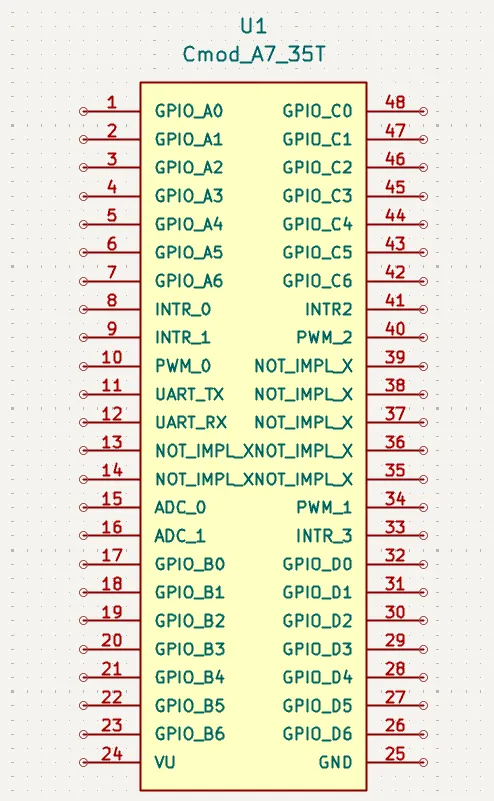
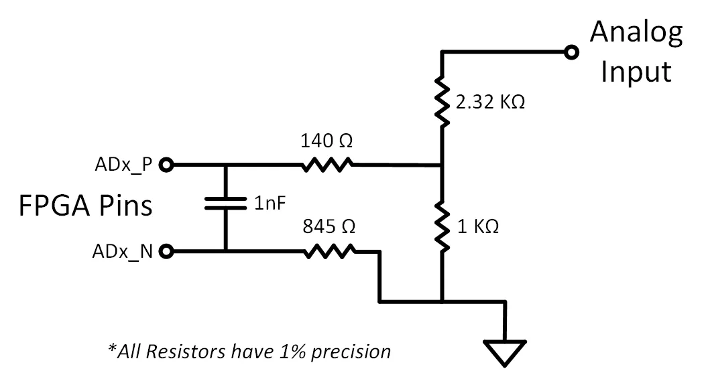

# Cmod A7-35T Pin Specification

## 1. DIP Connector Overview

The Cmod A7-35T has a 48-pin DIP connector (J1). All digital I/O pins operate at **LVCMOS33** (3.3 V logic level) with **no series resistors**.

*Figure 1. U1 Cmod A7-35T DIP Pinout (custom schematic symbol)*

| Category | Count |
|----------|-------|
| GPIO (4 groups × 7-bit) | 28 |
| External Interrupts | 4 |
| PWM Outputs | 3 |
| UART 1 (TX + RX) | 2 |
| Analog Inputs (XADC) | 2 |
| Not Implemented | 7 |
| Power (VU + GND) | 2 |
| **Total** | **48** |

---

## 2. Pin Map — Left Side (Pin 1–24)

| DIP Pin | Signal Name | FPGA Pin | Direction | Function |
|---------|-------------|----------|-----------|----------|
| 1 | GPIO_A0 | M3 | I/O | General purpose GPIO, Group A bit 0 |
| 2 | GPIO_A1 | L3 | I/O | General purpose GPIO, Group A bit 1 |
| 3 | GPIO_A2 | A16 | I/O | General purpose GPIO, Group A bit 2 |
| 4 | GPIO_A3 | K3 | I/O | General purpose GPIO, Group A bit 3 |
| 5 | GPIO_A4 | C15 | I/O | General purpose GPIO, Group A bit 4 |
| 6 | GPIO_A5 | H1 | I/O | General purpose GPIO, Group A bit 5 |
| 7 | GPIO_A6 | A15 | I/O | General purpose GPIO, Group A bit 6 |
| 8 | INTR_0 | B15 | Input | External interrupt input 0 |
| 9 | INTR_1 | A14 | Input | External interrupt input 1 |
| 10 | PWM_0 | J3 | Output | PWM output channel 0 (axi_timer) |
| 11 | UART_TX | J1 | Output | UART 1 transmit |
| 12 | UART_RX | K2 | Input | UART 1 receive |
| 13 | NOT_IMPL | L1 | — | Not implemented (pio[13]) |
| 14 | NOT_IMPL | L2 | — | Not implemented (pio[14]) |
| 15 | ADC_0 | G3 / G2 | Analog | XADC VAUX4 (ain_p[15] / ain_n[15]) |
| 16 | ADC_1 | H2 / J2 | Analog | XADC VAUX12 (ain_p[16] / ain_n[16]) |
| 17 | GPIO_B0 | M1 | I/O | General purpose GPIO, Group B bit 0 |
| 18 | GPIO_B1 | N3 | I/O | General purpose GPIO, Group B bit 1 |
| 19 | GPIO_B2 | P3 | I/O | General purpose GPIO, Group B bit 2 |
| 20 | GPIO_B3 | M2 | I/O | General purpose GPIO, Group B bit 3 |
| 21 | GPIO_B4 | N1 | I/O | General purpose GPIO, Group B bit 4 |
| 22 | GPIO_B5 | N2 | I/O | General purpose GPIO, Group B bit 5 |
| 23 | GPIO_B6 | P1 | I/O | General purpose GPIO, Group B bit 6 |
| 24 | **VU** | — | Power | Power input (ext) / Power output (USB) |

---

## 3. Pin Map — Right Side (Pin 25–48)

| DIP Pin | Signal Name | FPGA Pin | Direction | Function |
|---------|-------------|----------|-----------|----------|
| 25 | **GND** | — | Power | Ground reference |
| 26 | GPIO_D6 | W2 | I/O | General purpose GPIO, Group D bit 6 |
| 27 | GPIO_D5 | U1 | I/O | General purpose GPIO, Group D bit 5 |
| 28 | GPIO_D4 | T2 | I/O | General purpose GPIO, Group D bit 4 |
| 29 | GPIO_D3 | T1 | I/O | General purpose GPIO, Group D bit 3 |
| 30 | GPIO_D2 | R2 | I/O | General purpose GPIO, Group D bit 2 |
| 31 | GPIO_D1 | T3 | I/O | General purpose GPIO, Group D bit 1 |
| 32 | GPIO_D0 | R3 | I/O | General purpose GPIO, Group D bit 0 |
| 33 | INTR_3 | V2 | Input | External interrupt input 3 |
| 34 | PWM_1 | W3 | Output | PWM output channel 1 (axi_timer) |
| 35 | NOT_IMPL | V3 | — | Not implemented (pio[35]) |
| 36 | NOT_IMPL | W5 | — | Not implemented (pio[36]) |
| 37 | NOT_IMPL | V4 | — | Not implemented (pio[37]) |
| 38 | NOT_IMPL | U4 | — | Not implemented (pio[38]) |
| 39 | NOT_IMPL | V5 | — | Not implemented (pio[39]) |
| 40 | PWM_2 | W4 | Output | PWM output channel 2 (axi_timer) |
| 41 | INTR_2 | U5 | Input | External interrupt input 2 |
| 42 | GPIO_C6 | U2 | I/O | General purpose GPIO, Group C bit 6 |
| 43 | GPIO_C5 | W6 | I/O | General purpose GPIO, Group C bit 5 |
| 44 | GPIO_C4 | U3 | I/O | General purpose GPIO, Group C bit 4 |
| 45 | GPIO_C3 | U7 | I/O | General purpose GPIO, Group C bit 3 |
| 46 | GPIO_C2 | W7 | I/O | General purpose GPIO, Group C bit 2 |
| 47 | GPIO_C1 | U8 | I/O | General purpose GPIO, Group C bit 1 |
| 48 | GPIO_C0 | V8 | I/O | General purpose GPIO, Group C bit 0 |

---

## 4. GPIO Groups — AXI Address Map

Each GPIO group is controlled by an AXI GPIO IP instance accessible from the MicroBlaze RISC-V processor.

| Group | Width | AXI Base Address | HDL Port Name | DIP Pins |
|-------|-------|-----------------|---------------|----------|
| A | 7-bit | 0x4003_0000 | `gpio_A_tri_io[6:0]` | 1–7 |
| B | 7-bit | 0x4004_0000 | `gpio_B_tri_io[6:0]` | 17–23 |
| C | 7-bit | 0x4005_0000 | `gpio_C_tri_io[6:0]` | 42–48 |
| D | 7-bit | 0x4006_0000 | `gpio_D_tri_io[6:0]` | 26–32 |

---

## 5. Interrupt Inputs — AXI Address Map

| Signal | DIP Pin | FPGA Pin | AXI Base Address | HDL Port Name |
|--------|---------|----------|-----------------|---------------|
| INTR_0 | 8 | B15 | 0x4007_0000 | `intr_tri_i[0]` |
| INTR_1 | 9 | A14 | 0x4007_0000 | `intr_tri_i[1]` |
| INTR_2 | 41 | U5 | 0x4007_0000 | `intr_tri_i[2]` |
| INTR_3 | 33 | V2 | 0x4007_0000 | `intr_tri_i[3]` |

All 4 interrupts are grouped into a single 4-bit AXI GPIO instance (INT_0_3) with interrupt capability enabled (`C_INTERRUPT_PRESENT = 1`).

---

## 6. PWM Outputs — AXI Address Map

| Signal | DIP Pin | FPGA Pin | AXI Base Address | IP Instance |
|--------|---------|----------|-----------------|-------------|
| PWM_0 | 10 | J3 | 0x41C1_0000 | PWM_0 (axi_timer) |
| PWM_1 | 34 | W3 | 0x41C2_0000 | PWM_1 (axi_timer) |
| PWM_2 | 40 | W4 | 0x41C3_0000 | PWM_2 (axi_timer) |

---

## 7. UART Interfaces

| Interface | TX Pin | RX Pin | TX FPGA | RX FPGA | AXI Base Address | Connection |
|-----------|--------|--------|---------|---------|-----------------|------------|
| UART 0 (USB) | J18 | J17 | J18 | J17 | 0x44A0_0000 | Via Micro-USB (J3), no DIP pin |
| UART 1 (External) | DIP 11 | DIP 12 | J1 | K2 | 0x44A1_0000 | Exposed on DIP connector |

Both are AXI UART16550 instances (16550-compatible).

---

## 8. Analog Inputs (XADC)

| Signal | DIP Pin | FPGA Pin (P/N) | XADC Channel |
|--------|---------|----------------|-------------|
| ADC_0 | 15 | G3 / G2 | VAUX4 |
| ADC_1 | 16 | H2 / J2 | VAUX12 |

XADC AXI base address: **0x44A3_0000**. The sequencer also monitors on-chip temperature, VCCINT, and VCCAUX.

### Analog Input Circuit

*Figure 2. On-board voltage divider circuit for XADC analog inputs (from Digilent Reference Manual)*

The XADC expects an input range of 0–1 V. The board includes a resistive voltage divider (2.32 KΩ / 1 KΩ, all 1% precision) that scales the DIP pin voltage down to the FPGA's acceptable range. A 140 Ω series resistor and 1 nF capacitor are placed on the differential pair for filtering. The ADx_N path has an 845 Ω series resistor.

| Parameter | Value |
|-----------|-------|
| Max input voltage on DIP pin 15/16 | **3.3 V** (relative to GND on pin 25) |
| Voltage at FPGA after divider | 0–1 V |
| Divider ratio | 1 KΩ / (2.32 KΩ + 1 KΩ) ≈ 0.301 |
| Resistor tolerance | 1% |

> **Note:** Pins 15 and 16 are routed through on-board voltage dividers. If used as analog inputs, they must **not** be assigned as digital I/O in the constraints file. Do not exceed 3.3 V on these pins.

---

## 9. Not Implemented Pins

These FPGA pins are physically connected to the DIP header but not assigned in the current design. They are available for future use.

| DIP Pin | FPGA Pin | Digilent Schematic Name |
|---------|----------|------------------------|
| 13 | L1 | pio[13] |
| 14 | L2 | pio[14] |
| 35 | V3 | pio[35] |
| 36 | W5 | pio[36] |
| 37 | V4 | pio[37] |
| 38 | U4 | pio[38] |
| 39 | V5 | pio[39] |

---

## 10. Internal Peripherals (No DIP Pin Exposure)

| Peripheral | AXI Base Address | Description |
|------------|-----------------|-------------|
| Board LEDs | 0x4000_0000 | 2-bit on-board LEDs (FPGA: A17, C16) |
| Board Button | 0x4001_0000 | 1-bit push button (FPGA: A18) |
| Board RGB LED | 0x4002_0000 | On-board RGB LED (FPGA: B17, B16, C17) |
| Timer 0 | 0x41C0_0000 | System timer with interrupt |
| Timer 1 | 0x41C4_0000 | System timer with interrupt |
| Timer 2 | 0x41C5_0000 | System timer with interrupt |
| AXI Interrupt Controller | 0x4120_0000 | 6 interrupt sources |
| QSPI Flash | 0x44A2_0000 | On-board Quad-SPI flash |
| SRAM (EMC) | 0x6000_0000 | 512 KB cellular RAM (32 MB address range) |

---

## 11. Electrical Characteristics

| Parameter | Value |
|-----------|-------|
| I/O Standard | LVCMOS33 (3.3 V) |
| Series Resistance on DIP Pins | None |
| Max Input Voltage (digital I/O) | See Artix-7 datasheet (~3.75 V abs. max for LVCMOS33) |
| Analog Input Range (Pin 15, 16) | 0–1 V (via on-board voltage divider) |
| Clock Source | 12 MHz oscillator (FPGA pin L17), PLL → 100 MHz |
