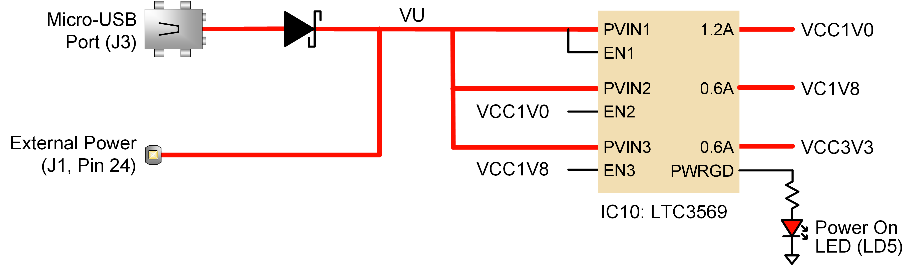

# Cmod A7-35T Power Specification

## 1. Overview

The Cmod A7-35T uses a **Linear Technologies LTC3569** triple-output buck regulator (IC10) to generate all onboard supply voltages from a single input rail called **VU**.

*Figure 1. Cmod A7 Power Supply (from Digilent Reference Manual)*

---

## 2. Power Input Options

The board can be powered from either of the following sources:

| Source | Connector | Schematic Net | Min Voltage | Recommended | Max Voltage |
|--------|-----------|---------------|-------------|-------------|-------------|
| USB | J3 (Micro-USB) | USB5V0 | 4.5 V | 5.0 V | 5.5 V |
| External Supply | J1 Pin 24 (DIP) | VU | 3.32 V* | 5.0 V | 5.5 V |

> \* The minimum external voltage on VU depends on the current drawn from the VCC3V3 rail via the Pmod header:
>
> - 0 mA drawn → minimum 3.32 V
> - 100 mA drawn → minimum 3.38 V
> - 250 mA drawn → minimum 3.48 V

GND reference is on **J1 Pin 25**.

---

## 3. Output Power Rails

All three rails are generated by the LTC3569 from the VU input.

| Rail | Typical Voltage | Min / Max Voltage | Max Current | Powered Devices |
|------|----------------|-------------------|-------------|-----------------|
| VCC1V0 | 1.00 V | 0.95 V / 1.05 V | 1.2 A | FPGA Core, Block RAM |
| VCC1V8 | 1.80 V | 1.71 V / 1.89 V | 0.6 A | FPGA AUX, ADC, USB Core |
| VCC3V3 | 3.30 V | 3.135 V / 3.465 V | 0.6 A | SRAM, USB Controller, Pmod, LEDs, Buttons, FPGA User I/O |

### Power-Up Sequence

The LTC3569 enable pins are daisy-chained to enforce a sequential startup:

1. **VCC1V0** starts first (EN1 tied high)
2. **VCC1V8** starts after VCC1V0 is stable (EN2 driven by VCC1V0)
3. **VCC3V3** starts after VCC1V8 is stable (EN3 driven by VCC1V8)

The **PWRGD** (Power Good) output drives the Power On LED (LD5).

---

## 4. VU Pin Behavior

| Condition | VU Pin Function |
|-----------|----------------|
| USB connected | VU is an **output** — driven by USB 5V through a Schottky diode (expect ~5 V with small drop) |
| USB not connected | VU is an **input** — accepts external power supply (3.32–5.5 V) |

---

## 5. Dual Power Source (USB + External)

It is possible to power the board from both USB and VU simultaneously, **but only if a Schottky diode is added in series with the external supply on the VU pin** to prevent current backflow.

Without the additional diode, **do not connect both sources at the same time**.

---

## 6. Warnings

- When a USB host is attached, the VU pin is driven to USB voltage (4.5–5.5 V). Any external power source on VU **must be disconnected first** before plugging in USB, or the external supply may be damaged.
- This is **especially dangerous with battery power sources**, as batteries cannot tolerate reverse current.
- The FPGA I/O pins on the DIP connector have **no series resistors**. Do not exceed the absolute maximum voltage ratings specified in the Artix-7 datasheet.

---

## 7. Quick Reference for External Power Design

| Parameter | Value |
|-----------|-------|
| Input Connector | J1 Pin 24 (VU) + Pin 25 (GND) |
| Recommended Input Voltage | 5.0 V |
| Acceptable Input Range | 3.32 – 5.5 V |
| Total Max Current (all rails) | ~2.4 A (1.2 + 0.6 + 0.6) |
| Power Good Indicator | LD5 (LED) |
| Regulator IC | LTC3569 |
| Protection Required for Dual Supply | Schottky diode in series with VU |
